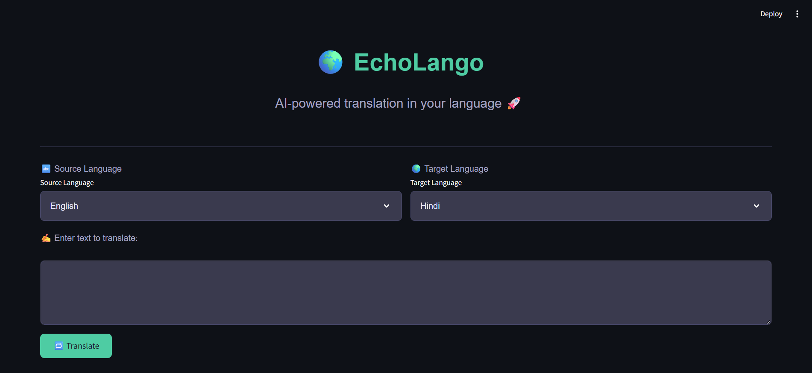
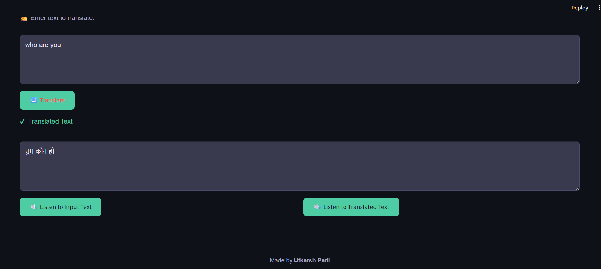
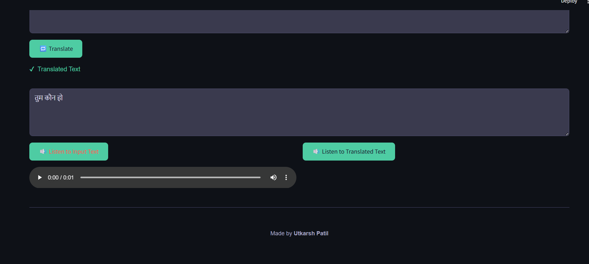

# 🌐 EchoLango - AI Language Translator

**EchoLango** is a multilingual translation web app built with **Streamlit**, powered by **LLaMA 3** via **Groq API**, and enhanced with **gTTS** for text-to-speech functionality. It translates text between various languages and lets users listen to both original and translated content with a sleek, dark-themed interface.

👉 **[EchoLango Live Demo](#)**

---

## 🚀 Features

- 🔁 Translate text between multiple languages with a modern dark theme  
- 🧠 Uses LLaMA 3 (70B) model for high-quality, culturally accurate translations  
- 🔊 Listen to original and translated text using gTTS  
- ⚡ Fast response time using Groq's inference engine  
- 💻 Intuitive Streamlit UI with enhanced readability and interactivity  
- 🐞 Bug-free experience with resolved session state issues  

---

## 🌍 Supported Languages

- English  
- Hindi  
*(Additional languages can be added by updating the `LANGUAGES` dictionary in `languages.py`)*

---

## 🛠️ Tech Stack

- **Frontend:** Streamlit  
- **LLM:** Groq API  
- **Translation Logic:** LangChain + LLaMA 3  
- **Text-to-Speech:** gTTS  
- **Language Detection:** langdetect  

---

## 📦 Installation

### 1. Clone the repo:

```bash
git clone https://github.com/Up9777/Language-Translator.git
````

### 2. Install dependencies:

```bash
pip install -r requirements.txt
```

### 3. Set up Groq API Key:

Open `app.py` and set your key:

```python
GROQ_API_KEY = "your_groq_api_key_here"
```

### 4. Create `languages.py` (if not already present):

Create a file named `languages.py` in the same directory as `app.py` with the following content:

```python
LANGUAGES = {
    "English": "en",
    "Hindi": "hi",
}
```

### 5. Run the app:

```bash
streamlit run app.py
```

---

## 📸 Screenshots

### 🔳 Dark-themed Interface


### ✅ Translation Output


### 🔊 Audio Playback



---

## ✏️ Usage

**EchoLango** is your multilingual assistant for:

* 🌍 Language Translation with a visually appealing dark theme
* 🗣️ Text-to-Speech Playback for both input and translated text
* 🧠 AI-Powered Accuracy with LLaMA 3
* 🧑‍🏫 Learning New Languages with audio support

---

## 📌 Example

**🔸 Input:**

* Source Language: English
* Target Language: Hindi
* Text to Translate: `Who are you?`

**🔸 Output:**

* Translated Text: `तुम कौन हो?`

---

## 🙌 Credits

Created by **Utkarsh Patil** ✨
Special thanks to all contributors and open-source libraries used in this project.

---

## 📄 License

This project is open-source and available under the **MIT License**.

```

Let me know if you want me to insert images, links, or badges in the README as well!
```
